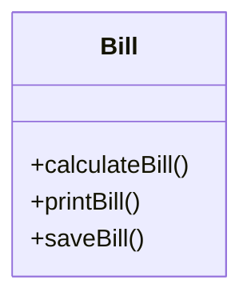

They are the 5 essential guidelines that enhance the software design. Making the code more scalable and maintainable.

## 1. Single Responsibility Principle
One module should only have only one responsibility.

Ex:
Let there be a class employee 
let this class have 3 methods
`calculateSalary()` -> CFO
`calculateHours()` -> HR
`saveEmpData()` -> Technical

> if one of the actor changes the implementation of a function used by another actor then the latter actor could be receiving wrong response thereafter.

```java
int calculateSalary() {
	getEmployeeData();
	//...
}

int calculateHours() {
	getEmployeeData();
	//...
}
```

Here the shared method `getEmployeeData()` is used by both of the functions, if the underlying implementation of the function is changed by one of the actors, then the other actor could receive wrong information...

The better implementation of this would be to create different classes which serve as independent units and don't internally depend on any of the functions used in either of the classes with different actors.

This specific approach adheres to SRP.

One more example.

Let's say we have a bill class with the following attributes.



but if the database team decides to change the saveBill() functionality by changing the structure of database. There is a lot of chance that other functions will be affected by this change too...

Thus it is better in practice to just create different classes for different actors on one Class. Hence each class is meant to only have a single responsibility.

so we divide it like:

`BillPrinter()` -> `printBill()`
`BillSaver()` -> `saveBill()`
`BillCalc()` -> `calculateBill()`

---
# Open Closed Principle
This states that software entities must be open for extension but closed for modification.

For ex:

let there be a class `BankAccount`
```java
BankAccount {
	string name;
	string address;
	double balance;

	// getter, setter for the above fields

	double calculateInterest(string acctype) {
		if(acctype.equals("Saving")){
			return this.balance*0.3;
		} else {
			return this.balance*0.5;
		}
	}
}
```

let's suppose we need to add one more entry for another type of interest rate for another type of program...

to fix this we use OCP, but to first implement OCP, we use SRP first.

so we do:

`Account` class containing `name`, `address`, `balance`
then make an interface `IAccount` defining the abstract `calculateInterest()` method and then create multiple classes that implement this interface and extend `Account` class like: `SavingAccount` etc...

```java
interface IAccount {
    double calculateInterest();
}

class Account {
    String name;
    String address;
    double balance;

    Account(String name, String address, double balance) {
        this.name = name;
        this.address = address;
        this.balance = balance;
    }
}

class SavingAccount extends Account implements IAccount {
    private final double interestRate = 0.04;

    SavingAccount(String name, String address, double balance) {
        super(name, address, balance);
    }

    public double calculateInterest() {
        return balance * interestRate;
    }
}

class FixedDepositAccount extends Account implements IAccount {
    private final double interestRate = 0.075;

    FixedDepositAccount(String name, String address, double balance) {
        super(name, address, balance);
    }

    public double calculateInterest() {
        return balance * interestRate;
    }
}

class CurrentAccount extends Account implements IAccount {
    private final double interestRate = 0.02;

    CurrentAccount(String name, String address, double balance) {
        super(name, address, balance);
    }

    public double calculateInterest() {
        return balance * interestRate;
    }
}

```

---
# Liskov's Substitution Principle
Derived or child classes must be substitute-able for their base or parent classes.

More formally:
> if f(x) is a property provable about objects x of T type. Then f(y) should be provable for objects y of type S as well if S is a subset of T.

One of the classic examples of this principle is a rectangle having four sides. A rectangle's height can be any value and width can be any value. A square is a rectangle with equal width and height. So we can say that we can extend the properties of the rectangle class into square class.

```java
class Rectangle {
    protected int width;
    protected int height;

    public void setWidth(int width) {
        this.width = width;
    }

    public void setHeight(int height) {
        this.height = height;
    }

    public int getArea() {
        return width * height;
    }
}

class Square extends Rectangle {
    @Override
    public void setWidth(int width) {
        this.width = width;
        this.height = width; 
    }

    @Override
    public void setHeight(int height) {
        this.height = height;
        this.width = height; 
    }
}

public class LSPViolation {
    public static void main(String[] args) {
        Rectangle rect = new Square(); 
        rect.setWidth(5);
        rect.setHeight(10);
        System.out.println("Area: " + rect.getArea());
    }
}

```

This violates the LSP since the implementation of the square class cannot fulfill the role of the parent class.

this also implies that 
> If a function takes a class, it should also be able to take the derived class from that one particular class as well.

---
# 4. Interface Segregation Principle
One interface should not be handling many responsibilities but multiple interfaces should be handling multiple responsibilities.

> Design interfaces in such way that the classes implementing the interfaces do not have too many unused functions.

This codes violates ISP
```java
interface Worker {
    void work();
    void eat();  // Not all workers need to eat!
}

class HumanWorker implements Worker {
    public void work() {
        System.out.println("Human working...");
    }

    public void eat() {
        System.out.println("Human eating...");
    }
}

class RobotWorker implements Worker {
    public void work() {
        System.out.println("Robot working...");
    }

    public void eat() {
        // Robots don't eat — so this is forced and meaningless.
        throw new UnsupportedOperationException("Robots don't eat.");
    }
}

```

but this one doesn't
```java
interface Workable {
    void work();
}

interface Eatable {
    void eat();
}

class HumanWorker implements Workable, Eatable {
    public void work() {
        System.out.println("Human working...");
    }

    public void eat() {
        System.out.println("Human eating...");
    }
}

class RobotWorker implements Workable {
    public void work() {
        System.out.println("Robot working...");
    }
}

```

---
# 5. Dependency Inversion Principle
